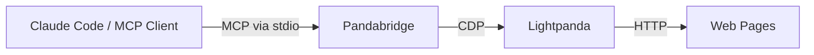

```text
██████╗  █████╗ ███╗   ██╗██████╗  █████╗ ██████╗ ██████╗ ██╗██████╗  ██████╗ ███████╗
██╔══██╗██╔══██╗████╗  ██║██╔══██╗██╔══██╗██╔══██╗██╔══██╗██║██╔══██╗██╔════╝ ██╔════╝
██████╔╝███████║██╔██╗ ██║██║  ██║███████║██████╔╝██████╔╝██║██║  ██║██║  ███╗█████╗
██╔═══╝ ██╔══██║██║╚██╗██║██║  ██║██╔══██║██╔══██╗██╔══██╗██║██║  ██║██║   ██║██╔══╝
██║     ██║  ██║██║ ╚████║██████╔╝██║  ██║██████╔╝██║  ██║██║██████╔╝╚██████╔╝███████╗
╚═╝     ╚═╝  ╚═╝╚═╝  ╚═══╝╚═════╝ ╚═╝  ╚═╝╚═════╝ ╚═╝  ╚═╝╚═╝╚═════╝  ╚═════╝ ╚══════╝
                                  proofofwork
```

# Pandabridge

**Fast web research, scraping, and compact browser diagnosis for AI agents, powered by Lightpanda.**

Pandabridge gives Claude Code and other MCP clients a Lightpanda-backed browser surface with **23 tools**: **3 scraping tools** and **20 browser tools**. It is optimized for content extraction, rendered-page inspection, lightweight interaction, and token-efficient output.

## Why Pandabridge?

### The MCP Browser Tool Landscape

The Model Context Protocol (MCP) ecosystem has grown to over 200 servers as of February 2026, with browser automation being a critical use case. However, browser MCP tools face a fundamental challenge: **MCP is consuming 40-50% of available context windows before agents perform any actual work** (per Perplexity CTO Denis Yarats, March 2026), creating token efficiency and autonomy problems.

Pandabridge solves this through **Lightpanda-backed optimization** — delivering maximum browser capability with minimum token overhead.

### Tool Comparison

| Approach | Tools | Engine | Token Efficiency | Speed | Memory | Best For |
|----------|-------|--------|------------------|-------|--------|----------|
| **Pandabridge** | **23** | **Lightpanda** | **⭐⭐⭐⭐⭐** | **⭐⭐⭐⭐⭐** | **⭐⭐⭐⭐⭐** | **Agent loops, scraping, research** |
| Playwright MCP | 25+ | Full Chrome | ⭐⭐ | ⭐⭐⭐ | ⭐⭐ | Breadth + maturity |
| Chrome DevTools MCP | 29 | Full Chrome | ⭐⭐ | ⭐⭐⭐ | ⭐ | Deep debugging + performance |
| Lightpanda native MCP | 2-4 | Lightpanda | ⭐⭐⭐⭐ | ⭐⭐⭐⭐⭐ | ⭐⭐⭐⭐⭐ | Minimal, read-only |
| Browserbase / Stagehand | 10-15 | Cloud Chrome | ⭐ | ⭐⭐⭐ | ⭐ | Cloud-managed agents |

### Why Lightpanda?

**Lightpanda** (built from scratch in Zig, not a Chromium fork) delivers:
- **9x less memory** than Chrome
- **10x faster** rendering than Chromium in benchmarks
- **Full CDP support** compatible with Playwright
- **AI-optimized** from the ground up
- **Open-source** with active development

See [Lightpanda GitHub](https://github.com/lightpanda-io/browser) and [Lightpanda.io](https://lightpanda.io/) for details.

### What Makes Pandabridge Different

Pandabridge exists for a specific lane:

- **One-shot scraping**: `scrape_page` replaces `navigate -> markdown -> links` with one call, saving 3 tool calls and ~30% of tokens.
- **Batch extraction**: `scrape_batch` processes 10 URLs with partial failure handling — parallel would waste context if any URL fails.
- **Structured data extraction**: `extract_data` returns JSON from CSS selectors without arbitrary JS execution.
- **Token-efficient interaction**: click, type, select, scroll, inspect, and debug without flooding the model with raw browser output.
- **Claude-friendly output**: single-page tools include the current URL; multi-page batch responses skip a misleading single URL header.
- **Agent-first design**: Every tool is tuned for compact LLM-agent control loops, not for manual browser driving.

### Token Efficiency in Practice

A typical research task with Pandabridge vs. Playwright MCP:

**Pandabridge:** `scrape_page` → Process markdown → Follow link → `scrape_page` → Done
- 4 tool calls, ~1,200 tokens in tool overhead

**Playwright MCP:** `goto` → `getTitle` → `getMarkdown` → `getLinks` → `goto` → `getTitle` → `getMarkdown` → `getLinks` → Done
- 8 tool calls, ~2,000 tokens in tool overhead

Pandabridge saves ~40% tool overhead on common agent workflows.

## Use Cases

### Research & Content Extraction
- **Multi-page research loops**: Scrape → analyze → follow promising links → repeat. Pandabridge's compact output keeps context budgets reasonable.
- **Batch content collection**: Pull markdown from 5-10 URLs in one call with `scrape_batch`, perfect for gathering product specs, documentation, or news articles.
- **SEO & competitive analysis**: Extract metadata, headings, and link structure from competitor pages to identify ranking opportunities.

### Data Monitoring & Extraction
- **Price/listing monitoring**: Use `extract_data` with CSS selectors to pull structured JSON from product cards, real-estate listings, or job boards.
- **Content change detection**: Scrape the same page daily and let Claude Code detect and summarize what changed.
- **Lead generation**: Extract contact info, company details, and metadata from directories or search results.

### Form Automation & Interaction
- **Multi-step form filling**: `browser_type` to fill fields, `browser_click` to submit, `browser_wait_for` to detect results, `browser_interactive_elements` for accessibility.
- **Login workflows**: Navigate, fill credentials, click submit, wait for success, then scrape behind the login.
- **Search & filtering**: Click filters on e-commerce sites, wait for results, scrape the filtered page.

### Quality Assurance & Debugging
- **Rendered-page testing**: Check what the user actually sees (not just HTML source) — critical for CSS failures, lazy loading, or JS-powered UI issues.
- **Accessibility audits**: Use `browser_accessibility` to get a DOM outline and `browser_interactive_elements` to verify all buttons/inputs are discoverable.
- **Broken link detection**: Batch-scrape a sitemap and use `browser_errors` to catch 404s, redirects, and console errors.
- **Visual regression detection**: Use `browser_snapshot` to text-based page diffs across versions or browsers.

### Real-Time Agent Workflows
- **Agentic web research**: Claude Code asks questions → Pandabridge scrapes → Claude analyzes → Claude asks follow-up → Loop.
- **Dynamic data aggregation**: Navigate through paginated results, extract data from each page, aggregate into JSON, summarize.
- **Error diagnosis**: Run `browser_debug_report` with optional corrective actions to capture console errors, network failures, and page state in one call.

### Why Pandabridge Over Alternatives for These?

| Use Case | Pandabridge | Playwright MCP | Chrome DevTools MCP |
|----------|-------------|-----------------|-------------------|
| Batch scraping 5+ URLs | ✅ One tool, compact output | ⚠️ Multiple tool calls per URL | ❌ Not designed for batch |
| Research loops (token-limited) | ✅ Optimized token efficiency | ⚠️ 50% more token overhead | ❌ Not agent-focused |
| Form filling + verification | ✅ Full interaction suite | ✅ Also good | ⚠️ Overkill for forms |
| Price monitoring (daily scrapes) | ✅ Fast, low resource cost | ⚠️ Chrome memory footprint | ❌ Heavy for daily jobs |
| Accessibility audits | ✅ Built-in a11y tools | ⚠️ Manual accessibility inspection | ✅ Deep but complex |
| Multi-step agent workflows | ✅ Designed for agent loops | ⚠️ Tool overhead burns context | ❌ Built for debugging, not loops |

## Quick Start

### Install

```bash
npm install -g pandabridge
```

Or from source:

```bash
git clone https://github.com/proofofworks/pandabridge.git
cd pandabridge
npm install
npm run build
```

### Connect to Claude Code

Local Lightpanda:

```bash
lightpanda serve --host 127.0.0.1 --port 9222
claude mcp add pandabridge pandabridge
```

From source:

```bash
claude mcp add pandabridge node dist/index.js
```

Lightpanda Cloud / remote CDP:

```bash
export LIGHTPANDA_CDP_WS_URL=wss://your-instance.lightpanda.cloud
claude mcp add pandabridge pandabridge
```

Then ask Claude things like:

- `scrape example.com and summarize it`
- `extract all links from example.com`
- `open this page and tell me what is visibly broken`

## Tools

### Scraping

| Tool | Description |
|------|-------------|
| `scrape_page` | Navigate to a URL and return title, markdown, and links in one call |
| `scrape_batch` | Scrape multiple URLs sequentially with inline partial-failure reporting |
| `extract_data` | Extract structured JSON from the current page using CSS selectors |

### Navigation

| Tool | Description |
|------|-------------|
| `browser_navigate` | Navigate to a URL with redirect-safe domain checks |

### Interaction

| Tool | Description |
|------|-------------|
| `browser_click` | Click an element by selector or `elementId` |
| `browser_type` | Fill a text field |
| `browser_press_key` | Press a keyboard key |
| `browser_select_option` | Select a value in a `<select>` |
| `browser_scroll` | Scroll the page |

### Observation

| Tool | Description |
|------|-------------|
| `browser_snapshot` | Return a compact text snapshot of the rendered page |
| `browser_markdown` | Convert page HTML to markdown |
| `browser_links` | Extract links with optional substring and domain filters |
| `browser_interactive_elements` | List clickable/fillable elements with reusable `elementId`s |
| `browser_dom_query` | Query DOM elements with CSS selectors |
| `browser_accessibility` | Return a simplified accessibility-oriented DOM outline |

### Diagnosis

| Tool | Description |
|------|-------------|
| `browser_debug_report` | Navigate, optionally act, then summarize errors, requests, and console state |

### Utilities

| Tool | Description |
|------|-------------|
| `browser_evaluate` | Run JavaScript on the page when explicitly enabled |
| `browser_wait_for` | Wait for an element state |
| `browser_console_messages` | Read captured console output |
| `browser_network_requests` | Read captured network activity |
| `browser_errors` | Read captured uncaught page errors and crashes |
| `browser_cookies` | Read and manage cookies |
| `browser_status` | Check connection state, current URL, and page readiness |

## How It Works

### Plain English

Pandabridge is the translation layer between Claude Code and Lightpanda:

1. Claude calls an MCP tool like `scrape_page` or `browser_navigate`.
2. Pandabridge turns that into CDP / Playwright actions against Lightpanda.
3. Lightpanda loads and renders the page.
4. Pandabridge compresses the result into a smaller, agent-usable response.
5. Claude reasons over that output and decides the next step.

### System Overview



### Startup and Connection Model

- Config resolves from **environment variables -> `~/.pandabridge/config.json` -> defaults**.
- Pandabridge can:
  - connect to a running local Lightpanda instance
  - auto-start a local Lightpanda binary when `LIGHTPANDA_BINARY` is set
  - connect directly to a remote CDP WebSocket via `LIGHTPANDA_CDP_WS_URL`
- CDP connection uses retry + backoff.
- The active browser/page state lives in memory and is recovered when possible.

### Output Model

Pandabridge is opinionated about output size:

- all single-page tool responses go through `formatToolResponse()`
- array-style outputs go through `capArray()`
- text outputs are truncated to `outputMaxChars`
- interactive elements are compacted and assigned reusable `elementId`s
- logs use ring buffers to prevent unbounded memory growth

Example of the compacting strategy:

Instead of a long JSON blob for an element, Pandabridge returns a short line like:

```text
[1] e1-1 button#submit "Submit" (type=submit)
```

### Safety Model

- Domain rules are enforced before navigation and **again after redirects**.
- Current-page tools validate the active page domain before operating.
- `browser_evaluate` is disabled by default because arbitrary JS execution is risky in LLM-driven workflows.

### Hooks

Pandabridge ships optional Claude Code hooks for:

- auto-starting Lightpanda
- blocking restricted URLs before tool execution
- compressing oversized output
- logging tool errors

Install them with:

```bash
npm run setup-hooks
```

## Competitive Position

Pandabridge is not trying to beat every browser tool on every dimension.

### Strongest direct alternatives

| Product | Best at | Where Pandabridge differs |
|---------|---------|---------------------------|
| Playwright MCP | Breadth, maturity, multi-browser support | Pandabridge is smaller, lighter, and more scraping-focused |
| Chrome DevTools MCP | Deep debugging, traces, screenshots, performance | Pandabridge is cheaper and simpler, but less deep |
| Lightpanda native MCP | Minimal setup on the same engine | Pandabridge is dramatically more capable on top of Lightpanda |
| Browserbase / Stagehand | Cloud-managed browser agents | Pandabridge is local-first and simpler |
| Vercel agent-browser | CLI-first token efficiency | Pandabridge stays MCP-native for Claude Code workflows |

### Where Pandabridge is strong

- **Lightpanda-backed performance characteristics**
- **Scraping-first MCP surface**
- **Compact responses for agent loops**
- **Local-first setup**
- **Useful middle ground** between ultra-minimal MCPs and giant Chrome-first toolsets

### Where it is not best-in-class

- screenshots and artifact-heavy debugging
- performance traces and memory tooling
- source maps and framework component introspection
- multi-tab workflows
- file upload / drag / hover / device emulation

If you need Chrome-DevTools-grade debugging depth, use a Chrome-based tool. If you need **fast scraping plus compact browser interaction inside Claude Code**, Pandabridge is the better fit.

## Known Limits

- Pandabridge is strongest for **scraping, rendered-page inspection, compact diagnosis, and light interaction**.
- It is **not** a full Chrome DevTools replacement.
- It does **not** expose source maps, breakpoint debugging, performance traces, or framework component stacks.
- `browser_accessibility` is a simplified accessibility-oriented DOM outline, not a true browser accessibility tree.
- Framework-heavy SPAs can usually be navigated and scraped, but runtime/framework diagnostics may still be shallower than Chrome-based tooling.

## Configuration

Set via environment variables or `~/.pandabridge/config.json`:

```bash
export LIGHTPANDA_HOST=127.0.0.1
export LIGHTPANDA_PORT=9222
export LIGHTPANDA_BINARY=/usr/local/bin/lightpanda
export LIGHTPANDA_CDP_WS_URL=wss://...        # remote CDP / Lightpanda Cloud
export PANDABRIDGE_BATCH_MAX_URLS=10
export PANDABRIDGE_OUTPUT_MAX_CHARS=8000
export PANDABRIDGE_OUTPUT_MAX_ELEMENTS=50
export PANDABRIDGE_DEFAULT_TIMEOUT=15000
export PANDABRIDGE_EVALUATE_ENABLED=false
export PANDABRIDGE_DEBUG=false
```

## Documentation

- **[Setup Guide](docs/setup.md)** — installation, configuration, hooks, troubleshooting
- **[Roadmap](docs/roadmap.md)** — shipped work and next priorities

## License

[MIT](LICENSE)
